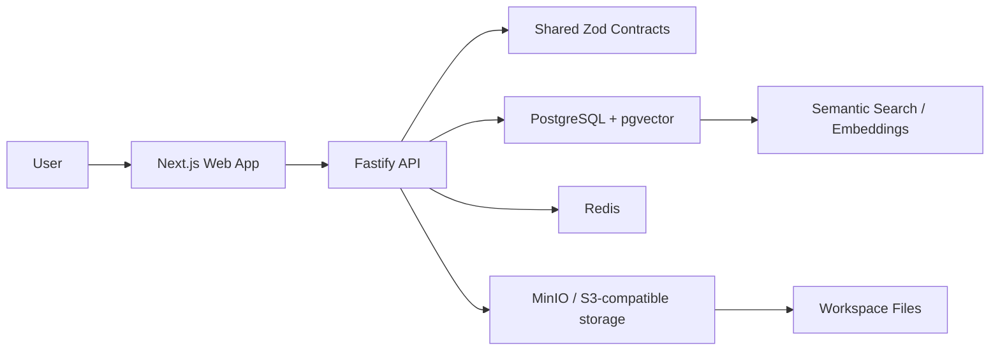
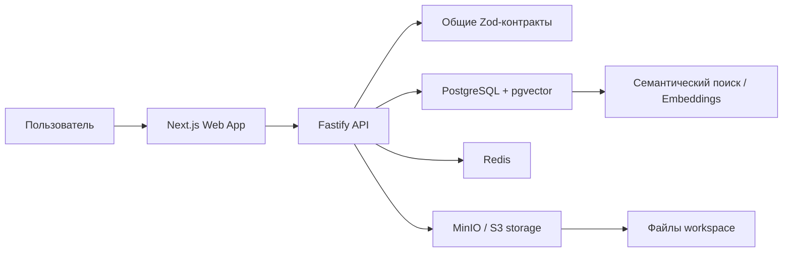

# Yadraw

**Visual workspace for JSON cards, workflows, files, and AI-ready knowledge graphs.**

[](https://nodejs.org/)
[](https://nextjs.org/)
[](https://fastify.dev/)
[](https://www.postgresql.org/)
[](https://www.typescriptlang.org/)

Yadraw is an early-stage product foundation for building structured visual systems: boards, JSON-backed cards, typed connections, attached files, semantic search, and AI-assisted workflow automation.

It is designed as a serious base for a product where every node on the canvas can be both a visual object and a structured data object.

## Screenshots


## Languages

- [English](#english)
- [Русский](#русский)

---

## English

### What It Is

Yadraw is a visual editor for JSON-native operational workflows. The core idea is simple: each card is not only a visual block, but also a typed data entity that can hold metadata, inputs, outputs, files, status, layout, and future AI/search context.

The current implementation is the first production-oriented foundation:

- a professional Next.js board UI
- editable cards with inspector fields
- Fastify API with board/card endpoints
- PostgreSQL-backed storage with memory fallback
- shared Zod contracts for frontend and backend
- database schema for workspaces, projects, boards, cards, connections, files, snapshots, AI actions, and embeddings
- local Docker infrastructure with PostgreSQL, Redis, and MinIO
- tests for shared schemas and repository behavior
- initial security review and baseline browser/API hardening

### Product Direction

Yadraw is intended to become a workspace where teams can model, run, inspect, and search structured processes:

- AI pipelines
- data sync flows
- document and file workflows
- operational playbooks
- integration maps
- knowledge graphs
- visual JSON databases

The long-term goal is not just drawing diagrams. The goal is a canvas where every object is queryable, versioned, executable, and connected to real data.

### Architecture



### Repository Layout

```text
apps/
  web/          Next.js visual board editor
  api/          Fastify API service

packages/
  shared/       Domain schemas, TypeScript types, demo board data
  db/           SQL migrations and database package shell

infra/
  docker/       Local PostgreSQL, Redis, and MinIO stack

docs/
  screenshots/  README images
```

### Current Capabilities

| Area | Status |
| --- | --- |
| Visual board shell | Implemented |
| Card inspector | Implemented |
| Card create/update | Implemented |
| PostgreSQL persistence | Implemented |
| Memory fallback | Implemented |
| Shared schema validation | Implemented |
| Docker local infrastructure | Implemented |
| Tests | Implemented |
| Security baseline | Started |
| Authentication and workspace authorization | Planned |
| File uploads | Planned |
| AI search and embeddings | Planned |
| Workflow execution | Planned |

### Quick Start

Requirements:

- Node.js 22+
- npm 11+
- Docker Desktop

Install dependencies:

```bash
npm install
```

Start local infrastructure:

```bash
npm run infra:up
```

Create local environment:

```bash
copy .env.example .env
```

Start the API:

```bash
npm run dev:api
```

Start the web app:

```bash
npm run dev:web
```

Open:

```text
http://127.0.0.1:3000
```

### API

```text
GET  /health
GET  /boards/b4f94635-6fd5-4a6b-8608-61a69c81fbe2
GET  /search?q=enrich
POST /boards/:boardId/cards
PATCH /cards/:cardId
```

Example health response:

```json
{"ok":true,"service":"yadraw-api","storage":"postgres"}
```

If PostgreSQL is unavailable, the API falls back to the in-memory demo board.

### Quality Checks

```bash
npm run test
npm run typecheck
npm run build
```

Current test coverage includes:

- shared domain schemas
- card defaults and validation
- in-memory repository behavior
- card creation, update, search, and missing-entity handling

### Security Notes

The repository includes [SECURITY_REVIEW.md](SECURITY_REVIEW.md) with the current review results.

Implemented baseline protections:

- CORS allowlist via `CORS_ORIGIN`
- browser security headers in Next.js
- parameterized SQL queries
- `.env` excluded from Git
- no direct DOM XSS sinks found in the current application scan

Known next security milestone:

- API authentication
- workspace membership checks
- role-based permissions
- CSP with nonces/report-only rollout

---

## Русский

### Что Это

Yadraw - визуальный редактор для JSON-native рабочих процессов. Главная идея: каждая карточка на доске является не только визуальным блоком, но и типизированной сущностью данных с метаданными, входами, выходами, файлами, статусом, позицией и будущим контекстом для AI-поиска.

Текущая версия - первый серьезный фундамент продукта:

- профессиональный интерфейс доски на Next.js
- редактируемые карточки и боковой инспектор
- API на Fastify для досок и карточек
- хранение в PostgreSQL с fallback в память
- общие Zod-контракты для frontend и backend
- схема базы для workspace, проектов, досок, карточек, связей, файлов, снапшотов, AI-действий и embeddings
- локальная инфраструктура Docker: PostgreSQL, Redis, MinIO
- тесты для схем и серверного хранилища
- первичная проверка безопасности и базовое усиление API/web

### Продуктовое Направление

Yadraw должен стать рабочим пространством, где команды смогут моделировать, запускать, проверять и искать структурированные процессы:

- AI-пайплайны
- синхронизации данных
- процессы с документами и файлами
- операционные сценарии
- карты интеграций
- графы знаний
- визуальные JSON-базы

Цель - не просто редактор диаграмм. Цель - canvas, где каждый объект можно искать, версионировать, выполнять и связывать с реальными данными.

### Архитектура



### Структура Репозитория

```text
apps/
  web/          визуальный редактор доски на Next.js
  api/          серверный API на Fastify

packages/
  shared/       схемы домена, TypeScript-типы, demo board
  db/           SQL-миграции и оболочка DB-пакета

infra/
  docker/       локальный стек PostgreSQL, Redis и MinIO

docs/
  screenshots/  изображения для README
```

### Что Уже Есть

| Зона | Статус |
| --- | --- |
| Визуальная оболочка доски | Реализовано |
| Инспектор карточки | Реализовано |
| Создание и обновление карточек | Реализовано |
| Хранение в PostgreSQL | Реализовано |
| Fallback в память | Реализовано |
| Общая валидация схем | Реализовано |
| Локальная Docker-инфраструктура | Реализовано |
| Тесты | Реализовано |
| Базовая безопасность | Начато |
| Авторизация и роли workspace | Запланировано |
| Загрузка файлов | Запланировано |
| AI-поиск и embeddings | Запланировано |
| Выполнение workflow | Запланировано |

### Быстрый Запуск

Требования:

- Node.js 22+
- npm 11+
- Docker Desktop

Установить зависимости:

```bash
npm install
```

Запустить локальную инфраструктуру:

```bash
npm run infra:up
```

Создать локальный env-файл:

```bash
copy .env.example .env
```

Запустить API:

```bash
npm run dev:api
```

Запустить web-приложение:

```bash
npm run dev:web
```

Открыть:

```text
http://127.0.0.1:3000
```

### API

```text
GET  /health
GET  /boards/b4f94635-6fd5-4a6b-8608-61a69c81fbe2
GET  /search?q=enrich
POST /boards/:boardId/cards
PATCH /cards/:cardId
```

Пример ответа health:

```json
{"ok":true,"service":"yadraw-api","storage":"postgres"}
```

Если PostgreSQL недоступен, API автоматически использует demo board в памяти.

### Проверки Качества

```bash
npm run test
npm run typecheck
npm run build
```

Сейчас тестами покрыты:

- общие доменные схемы
- дефолты и валидация карточек
- поведение in-memory репозитория
- создание, обновление, поиск и обработка отсутствующих сущностей

### Безопасность

Текущий отчет находится в [SECURITY_REVIEW.md](SECURITY_REVIEW.md).

Уже сделано:

- CORS allowlist через `CORS_ORIGIN`
- security headers в Next.js
- параметризованные SQL-запросы
- `.env` исключен из Git
- в текущем скане не найдено прямых DOM XSS-синков

Следующий важный security-этап:

- авторизация API
- проверка membership в workspace
- роли и права доступа
- CSP через nonce/report-only rollout

---

## Roadmap

1. Authentication and workspace authorization
2. Connection creation and editing
3. Undo/redo and board snapshots
4. File upload and card attachments
5. AI search with embeddings
6. Workflow execution engine
7. Production deployment profile

## License

Private project foundation. License to be defined.
