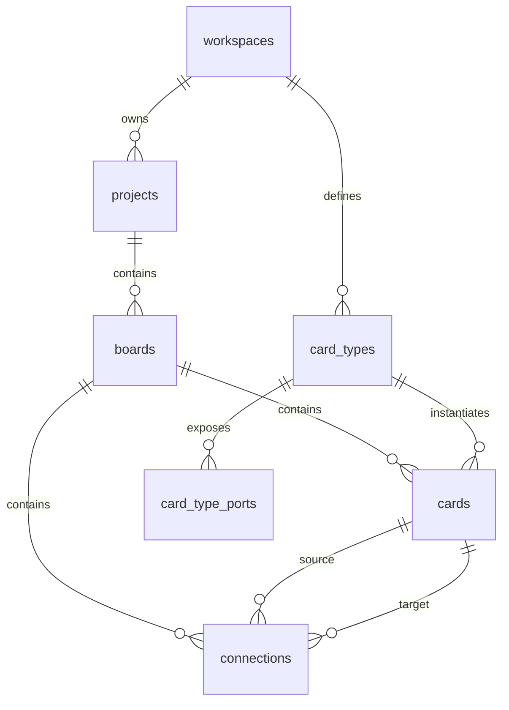

# Yadraw V2 Database Schema

## Goal

This document defines the clean v2 PostgreSQL schema for the first Yadraw foundation milestone.

The schema supports only the core board workflow:

- workspaces
- projects
- boards
- card types
- cards
- typed card ports
- typed connections

It intentionally excludes demo-only data, AI features, files, notifications, real-time collaboration, workflow execution, and advanced permissions.

## Design Principles

1. The database is the source of truth.
2. Domain fields must be explicit columns or explicit related tables.
3. `cards.data` is reserved for user/domain JSON only.
4. Internal app metadata must not be stored inside `cards.data`.
5. Coordinates and dimensions are scalar columns, not JSON blobs.
6. Demo seed data must live in seed scripts, not reusable domain modules.
7. Every row belongs to a workspace.
8. Board reads should be deterministic and easy to assemble.
9. The first schema should be small enough to understand in one sitting.

## Extensions

```sql
create extension if not exists "pgcrypto";
```

`pgcrypto` is enough for v2 foundation UUID generation. `vector`, `pg_trgm`, Redis, object storage, and search-specific extensions are out of scope for the first milestone.

## Shared Conventions

All primary keys are UUIDs generated by PostgreSQL:

```sql
id uuid primary key default gen_random_uuid()
```

All mutable domain tables include:

```sql
created_at timestamptz not null default now(),
updated_at timestamptz not null default now(),
deleted_at timestamptz
```

`deleted_at` is used for soft delete where restoring or preserving relationships matters. Hard delete can be added later behind service-level decisions.

`updated_at` is maintained through one shared trigger:

```sql
create or replace function set_updated_at()
returns trigger as $$
begin
  new.updated_at = now();
  return new;
end;
$$ language plpgsql;
```

## Types

```sql
create type card_status as enum (
  'draft',
  'active',
  'archived'
);

create type port_direction as enum (
  'input',
  'output'
);

create type connection_status as enum (
  'active',
  'disabled'
);
```

Keep statuses intentionally small. Error states, approvals, publishing, and workflow runtime states are not v2 foundation concerns.

## Entity Relationship Overview



## Tables

### workspaces

```sql
create table workspaces (
  id uuid primary key default gen_random_uuid(),
  name text not null,
  slug text not null,
  created_at timestamptz not null default now(),
  updated_at timestamptz not null default now(),
  deleted_at timestamptz,

  constraint workspaces_name_not_blank check (length(trim(name)) > 0),
  constraint workspaces_slug_not_blank check (length(trim(slug)) > 0),
  constraint workspaces_slug_format check (slug ~ '^[a-z0-9]([a-z0-9-]*[a-z0-9])?$')
);

create unique index workspaces_slug_active_unique
  on workspaces(slug)
  where deleted_at is null;
```

Workspace is the top-level ownership boundary. v2 does not need membership tables yet because authentication and advanced permissions are non-goals for the first milestone.

### projects

```sql
create table projects (
  id uuid primary key default gen_random_uuid(),
  workspace_id uuid not null references workspaces(id) on delete cascade,
  name text not null,
  created_at timestamptz not null default now(),
  updated_at timestamptz not null default now(),
  deleted_at timestamptz,

  constraint projects_workspace_id_id_unique unique (workspace_id, id),
  constraint projects_name_not_blank check (length(trim(name)) > 0)
);

create index projects_workspace_id_idx
  on projects(workspace_id)
  where deleted_at is null;
```

Projects are simple containers. Descriptions, icons, ownership metadata, and project settings can be added when there is a concrete workflow for them.

### boards

```sql
create table boards (
  id uuid primary key default gen_random_uuid(),
  workspace_id uuid not null references workspaces(id) on delete cascade,
  project_id uuid not null references projects(id) on delete cascade,
  name text not null,
  viewport_x numeric not null default 0,
  viewport_y numeric not null default 0,
  viewport_zoom numeric not null default 1,
  created_at timestamptz not null default now(),
  updated_at timestamptz not null default now(),
  deleted_at timestamptz,

  constraint boards_name_not_blank check (length(trim(name)) > 0),
  constraint boards_workspace_id_id_unique unique (workspace_id, id),
  constraint boards_viewport_zoom_positive check (viewport_zoom > 0),
  constraint boards_workspace_project_consistency
    foreign key (workspace_id, project_id)
    references projects(workspace_id, id)
);

create index boards_project_id_idx
  on boards(project_id)
  where deleted_at is null;

create index boards_workspace_id_idx
  on boards(workspace_id)
  where deleted_at is null;
```

The composite foreign key prevents a board from referencing a project in another workspace.

### card_types

```sql
create table card_types (
  id uuid primary key default gen_random_uuid(),
  workspace_id uuid not null references workspaces(id) on delete cascade,
  key text not null,
  name text not null,
  description text not null default '',
  default_data jsonb not null default '{}'::jsonb,
  default_width numeric not null default 300,
  default_height numeric not null default 180,
  created_at timestamptz not null default now(),
  updated_at timestamptz not null default now(),
  deleted_at timestamptz,

  constraint card_types_workspace_id_id_unique unique (workspace_id, id),
  constraint card_types_key_not_blank check (length(trim(key)) > 0),
  constraint card_types_key_format check (key ~ '^[a-z][a-z0-9_]*$'),
  constraint card_types_name_not_blank check (length(trim(name)) > 0),
  constraint card_types_default_data_is_object check (jsonb_typeof(default_data) = 'object'),
  constraint card_types_default_width_positive check (default_width > 0),
  constraint card_types_default_height_positive check (default_height > 0)
);

create unique index card_types_workspace_key_active_unique
  on card_types(workspace_id, key)
  where deleted_at is null;

create index card_types_workspace_id_idx
  on card_types(workspace_id)
  where deleted_at is null;
```

Card type metadata is intentionally small. Icons, colors, UI schemas, versioning, and marketplace behavior should wait until the basic card model is stable.

### card_type_ports

```sql
create table card_type_ports (
  id uuid primary key default gen_random_uuid(),
  workspace_id uuid not null references workspaces(id) on delete cascade,
  card_type_id uuid not null references card_types(id) on delete cascade,
  key text not null,
  label text not null,
  direction port_direction not null,
  data_type text not null default 'json',
  required boolean not null default false,
  sort_order integer not null default 0,
  created_at timestamptz not null default now(),
  updated_at timestamptz not null default now(),
  deleted_at timestamptz,

  constraint card_type_ports_key_not_blank check (length(trim(key)) > 0),
  constraint card_type_ports_key_format check (key ~ '^[a-z][a-z0-9_]*$'),
  constraint card_type_ports_label_not_blank check (length(trim(label)) > 0),
  constraint card_type_ports_data_type_not_blank check (length(trim(data_type)) > 0),
  constraint card_type_ports_workspace_type_consistency
    foreign key (workspace_id, card_type_id)
    references card_types(workspace_id, id)
);

create unique index card_type_ports_type_direction_key_active_unique
  on card_type_ports(card_type_id, direction, key)
  where deleted_at is null;

create index card_type_ports_card_type_id_idx
  on card_type_ports(card_type_id, direction, sort_order)
  where deleted_at is null;
```

Ports are first-class schema data. They are not stored in `cards.data`.

### cards

```sql
create table cards (
  id uuid primary key default gen_random_uuid(),
  workspace_id uuid not null references workspaces(id) on delete cascade,
  board_id uuid not null references boards(id) on delete cascade,
  card_type_id uuid not null references card_types(id),
  title text not null,
  description text not null default '',
  data jsonb not null default '{}'::jsonb,
  position_x numeric not null default 0,
  position_y numeric not null default 0,
  width numeric not null default 300,
  height numeric not null default 180,
  status card_status not null default 'draft',
  created_at timestamptz not null default now(),
  updated_at timestamptz not null default now(),
  deleted_at timestamptz,

  constraint cards_board_id_id_unique unique (board_id, id),
  constraint cards_title_not_blank check (length(trim(title)) > 0),
  constraint cards_data_is_object check (jsonb_typeof(data) = 'object'),
  constraint cards_data_no_internal_yadraw check (not (data ? '_yadraw')),
  constraint cards_width_positive check (width > 0),
  constraint cards_height_positive check (height > 0),
  constraint cards_workspace_board_consistency
    foreign key (workspace_id, board_id)
    references boards(workspace_id, id),
  constraint cards_workspace_type_consistency
    foreign key (workspace_id, card_type_id)
    references card_types(workspace_id, id)
);

create index cards_board_id_idx
  on cards(board_id)
  where deleted_at is null;

create index cards_workspace_id_idx
  on cards(workspace_id)
  where deleted_at is null;

create index cards_card_type_id_idx
  on cards(card_type_id)
  where deleted_at is null;
```

`cards.data` stores only user/domain JSON. App-owned fields such as card type, ports, files, tags, and visual position must be stored in explicit columns or related tables.

Tags are intentionally not included in the v2 foundation. They should become a separate feature when search/filter workflows exist.

### connections

```sql
create table connections (
  id uuid primary key default gen_random_uuid(),
  workspace_id uuid not null references workspaces(id) on delete cascade,
  board_id uuid not null references boards(id) on delete cascade,
  source_card_id uuid not null references cards(id),
  target_card_id uuid not null references cards(id),
  source_port_key text not null,
  target_port_key text not null,
  type text not null default 'data',
  label text not null default '',
  status connection_status not null default 'active',
  created_at timestamptz not null default now(),
  updated_at timestamptz not null default now(),
  deleted_at timestamptz,

  constraint connections_no_self_loop check (source_card_id <> target_card_id),
  constraint connections_source_port_key_not_blank check (length(trim(source_port_key)) > 0),
  constraint connections_target_port_key_not_blank check (length(trim(target_port_key)) > 0),
  constraint connections_type_not_blank check (length(trim(type)) > 0),
  constraint connections_workspace_board_consistency
    foreign key (workspace_id, board_id)
    references boards(workspace_id, id),
  constraint connections_source_card_on_board
    foreign key (board_id, source_card_id)
    references cards(board_id, id),
  constraint connections_target_card_on_board
    foreign key (board_id, target_card_id)
    references cards(board_id, id)
);

create unique index connections_active_unique
  on connections(board_id, source_card_id, source_port_key, target_card_id, target_port_key, type)
  where deleted_at is null;

create index connections_board_id_idx
  on connections(board_id)
  where deleted_at is null;

create index connections_source_card_id_idx
  on connections(source_card_id)
  where deleted_at is null;

create index connections_target_card_id_idx
  on connections(target_card_id)
  where deleted_at is null;
```

Port existence should be validated in the service layer for v2 foundation because it depends on joining card type definitions for both source and target cards. A future migration can enforce this more deeply if the model proves stable.

## Trigger Installation

```sql
drop trigger if exists trg_workspaces_updated_at on workspaces;
create trigger trg_workspaces_updated_at
before update on workspaces
for each row execute function set_updated_at();

drop trigger if exists trg_projects_updated_at on projects;
create trigger trg_projects_updated_at
before update on projects
for each row execute function set_updated_at();

drop trigger if exists trg_boards_updated_at on boards;
create trigger trg_boards_updated_at
before update on boards
for each row execute function set_updated_at();

drop trigger if exists trg_card_types_updated_at on card_types;
create trigger trg_card_types_updated_at
before update on card_types
for each row execute function set_updated_at();

drop trigger if exists trg_card_type_ports_updated_at on card_type_ports;
create trigger trg_card_type_ports_updated_at
before update on card_type_ports
for each row execute function set_updated_at();

drop trigger if exists trg_cards_updated_at on cards;
create trigger trg_cards_updated_at
before update on cards
for each row execute function set_updated_at();

drop trigger if exists trg_connections_updated_at on connections;
create trigger trg_connections_updated_at
before update on connections
for each row execute function set_updated_at();
```

## Read Model

The API should assemble a board response from:

- `boards`
- active `cards`
- each card's `card_type`
- active `card_type_ports`
- active `connections`

Recommended board query order:

1. Load board by `board_id`.
2. Load active cards ordered by `created_at`, then `id`.
3. Load card types and ports for card type IDs present on the board.
4. Load active connections ordered by `created_at`, then `id`.
5. Assemble a response DTO in the service layer.

Do not store a denormalized board snapshot in the primary v2 path.

## API DTO Mapping

The API may expose ergonomic objects to the frontend while keeping the database explicit.

Board DTO:

```ts
{
  viewport: {
    x: board.viewport_x,
    y: board.viewport_y,
    zoom: board.viewport_zoom
  }
}
```

Card type DTO:

```ts
{
  defaultSize: {
    width: cardType.default_width,
    height: cardType.default_height
  }
}
```

Card DTO:

```ts
{
  position: {
    x: card.position_x,
    y: card.position_y
  },
  size: {
    width: card.width,
    height: card.height
  }
}
```

This keeps the frontend pleasant without making the database depend on UI-shaped JSON blobs.

## Seed Data Boundary

Seed data should live in a dedicated file such as:

```text
packages/db/seeds/v2_local_seed.sql
```

Seed data may create:

- one workspace
- one project
- one board
- a small set of card types
- several ports per card type

Seed data must not be imported by runtime domain packages. Application code should not depend on hardcoded demo IDs.

## Explicitly Excluded Tables

These tables are not part of the v2 foundation schema:

- users
- workspace_members
- files
- card_files
- notifications
- activity_log
- embeddings
- board_snapshots
- workflow_runs
- workflow_steps
- api_keys
- invites

They can be added later through separate, workflow-driven migrations.

## First Migration Shape

When this design is implemented, prefer one focused v2 migration:

```text
packages/db/migrations/v2/001_core_foundation.sql
```

It should contain:

1. extension setup
2. enum creation
3. `set_updated_at`
4. core tables
5. supporting unique constraints
6. indexes
7. triggers

Local seed data should be separate from the schema migration.
